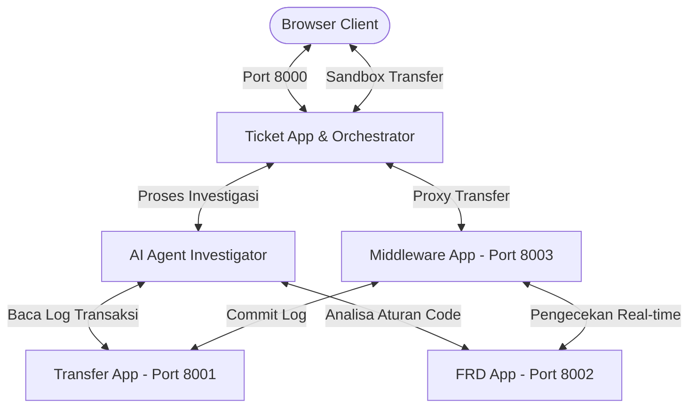

# 🛡️ Ticket Investigation System & AI Agent Dashboard

Sistem Investigasi Tiket Otomatis adalah aplikasi purwarupa terintegrasi penuh yang menyimulasikan deteksi fraud transaksi keuangan berbasis microservices. Sistem ini dilengkapi dengan **AI Agent Investigator** otomatis yang mampu mendeteksi kesalahan logika (*bug*) pada aturan keamanan, menyusun berkas laporan dokumen insiden PDF secara dinamis, melakukan triage penugasan tim, serta menyebarkan surel simulasi peringatan darurat.

Aplikasi dikemas dalam antarmuka web dasbor premium bertema **Cyber-Dark Glassmorphism** yang interaktif dan responsif.

---

## 🏗️ Arsitektur Layanan & Alokasi Port

Aplikasi berjalan pada arsitektur terdistribusi yang terdiri atas 4 microservices independen yang dikoordinasikan secara orkestrasional:



| Layanan | Port | Deskripsi |
| :--- | :---: | :--- |
| **Ticket App** | `8000` | Gateway antarmuka utama dasbor statis, manajemen tiket nasabah, pengeksekusi AI Agent, pengekspor PDF, dan pemicu simulasi surel. |
| **Transfer App**| `8001` | Penyimpan riwayat transfer dana instan nasabah secara persisten (`transactions.json`) serta menyajikan log audit. |
| **FRD App** | `8002` | Menyimpan aturan filter anti-fraud terprogram (`fraud_rule.py`) untuk analisis keabsahan transaksi. |
| **Middleware** | `8003` | Jembatan orkestrasi transaksi riil yang memverifikasi transaksi baru ke FRD App sebelum dicatat ke Transfer App. |

---

## 🚀 Fitur Utama Dasbor

*   **Dashboard Utama**: Memantau statistik tiket insiden dan transfer global secara real-time. Anda dapat mengajukan tiket pengaduan baru dan memicu simulasi terminal AI Agent baris-demi-baris yang interaktif.
*   **Playground Transaksi**: Form uji coba transfer dana langsung. Amati bagaimana Middleware memblokir transaksi pengguna jika dicurigai fraud atau meloloskannya jika dinilai aman.
*   **Simulator Surel Keluar (Outbox)**: Tampilan email client modern yang menangkap surel peringatan dari AI Agent. Menyertakan link unduhan berkas lampiran PDF laporan insiden riil.
*   **Pusat Log Terpusat (Microservice Logs)**: Membaca berkas log `middleware.log`, database internal `tickets.json` / `transactions.json`, serta memeriksa langsung kode aktif `fraud_rule.py` dari browser Anda.

---

## 📋 Prasyarat Sistem

Sebelum menginstal, pastikan mesin Anda telah terpasang komponen berikut:

*   **Python 3.9** atau versi yang lebih baru.
*   **Pip3** (Python Package Installer).
*   Peramban Web (Google Chrome, Mozilla Firefox, Safari, dll.).

---

## 🛠️ Langkah Instalasi

Ikuti langkah-langkah di bawah ini untuk memasang dan menjalankan sistem di lingkungan lokal Anda:

### 1. Klon Repositori
Silakan klon repositori ini ke komputer lokal Anda dan masuk ke direktori proyek:
```bash
git clone https://github.com/mitro-ubaidillah/AI-agent-Bug-Report.git
cd AI-agent-Bug-Report
```

### 2. Instalasi Dependensi
Instal pustaka-pustaka Python yang dibutuhkan sistem melalui terminal:
```bash
pip3 install fastapi uvicorn httpx fpdf2 python-multipart
```

*Catatan: Proyek menggunakan pustaka `fpdf2` untuk perenderan PDF yang andal dan `httpx` untuk komunikasi HTTP asynchronous antar-layanan.*

---

## ⚡ Cara Menjalankan Aplikasi

Sistem ini dilengkapi dengan script orkestrasional **`run_servers.py`** di direktori root untuk menghidupkan keempat microservices sekaligus tanpa perlu membuka banyak tab terminal.

### 1. Jalankan Orkestrator Server
Jalankan perintah berikut di terminal Anda:
```bash
python3 run_servers.py
```

Anda akan melihat output konsol berwarna-warni yang menandakan keempat microservice berhasil menyala secara paralel:
```text
[System Orchestrator] All 4 servers are up and running!
[System Orchestrator] - Ticket App: http://127.0.0.1:8000
[System Orchestrator] - Transfer App: http://127.0.0.1:8001
[System Orchestrator] - FRD App: http://127.0.0.1:8002
[System Orchestrator] - Middleware App: http://127.0.0.1:8003
```

### 2. Buka Dasbor Web
Buka web browser Anda dan akses halaman dasbor utama pada alamat:
👉 **[http://127.0.0.1:8000](http://127.0.0.1:8000)**

### 3. Mematikan Server secara Aman (Graceful Shutdown)
Untuk mematikan seluruh server microservice sekaligus, cukup kembali ke terminal tempat Anda menjalankan `run_servers.py` dan tekan kombinasi tombol:
```text
Ctrl + C
```
Sistem akan mematikan seluruh port di latar belakang secara bersih.

---

## 💡 Alur Kerja Simulasi Pengujian Proyek

Untuk mendemonstrasikan kekuatan AI Agent dalam melacak masalah, Anda dapat mengikuti skenario pengujian di bawah ini:

### Skenario: Kasus Pengaduan Blokir Transaksi USR002
1.  **Langkah 1 (Kirim Tiket)**: Di Dashboard Utama, ajukan tiket baru untuk user **`USR002`** dengan deskripsi *"Transfer ketiga saya diblokir secara sepihak padahal saldo mencukupi"*.
2.  **Langkah 2 (Picu AI Agent)**: Klik tombol **`🤖 Investigasi`** di samping tiket yang baru dibuat.
3.  **Langkah 3 (Amati Konsol AI)**: Lihat terminal simulator AI di sisi kanan mengalirkan log proses penelusuran riil (menghubungi middleware, menyalin log transaksi, meneliti baris logika anti-fraud).
4.  **Langkah 4 (Selesai)**: AI Agent akan mendeteksi bug logika di `fraud_rule.py` (kondisi `len(transactions) >= 3` langsung memblokir user tanpa menyaring lompatan nominal). Status tiket akan otomatis diubah menjadi `RESOLVED`.
5.  **Langkah 5 (Lihat Hasil)**: Klik tombol **`📄 Lihat Hasil`** untuk melihat ringkasan investigasi otomatis, kutipan bukti baris kode yang rusak, serta rekomendasi perbaikan terprogram. Klik **Unduh Laporan Resmi (PDF)** untuk mengunduh laporan PDF resmi.
6.  **Langkah 6 (Surel Masuk)**: Klik tab **Surel Keluar** di sidebar untuk memverifikasi surel peringatan insiden lengkap dengan dokumen lampiran laporan PDF telah dikirim secara simulasi ke **`frd-alerts@bank.local`** (karena tergolong kesalahan kode internal tim FRD).

---

## 📁 Struktur Direktori Proyek

```text
AI-agent-Bug-Report/
├── run_servers.py              # Script orkestrator peluncuran microservices
├── README.md                   # Petunjuk instalasi dan dokumentasi repositori
└── apps/
    ├── ticket_app/             # Layanan Utama (Port 8000)
    │   ├── main.py             # Server FastAPI & Proxy routing dashboard
    │   ├── ai_agent.py         # Logika penalaran & analisa kode AI Agent
    │   ├── pdf_generator.py    # Perender laporan PDF investigasi
    │   ├── email_sender.py     # Simulator penulisan outbox emails.json
    │   ├── tickets.json        # DB internal tiket insiden
    │   ├── reports.json        # DB internal hasil investigasi
    │   ├── emails.json         # DB internal surel tersimulasi
    │   ├── static/             # Assets Dashboard Web Frontend
    │   │   ├── index.html      # UI Dashboard
    │   │   ├── style.css       # Style Cyber-Dark Glassmorphism
    │   │   └── app.js          # Pengendali DOM, polling, & live log simulator
    │   └── output/             # Folder penyimpan PDF laporan hasil cetakan
    │
    ├── transfer_app/           # Layanan Transaksi Finansial (Port 8001)
    │   ├── main.py             # Server FastAPI log transaksi
    │   └── data/
    │       └── transactions.json # DB riwayat transfer nasabah
    │
    ├── frd_app/                # Layanan Aturan Anti-Fraud (Port 8002)
    │   ├── main.py             # Server FastAPI analisis fraud
    │   └── fraud_rule.py       # Logika aturan fraud (mengandung bug)
    │
    └── middleware_app/         # Layanan Gateway Otorisasi (Port 8003)
        ├── main.py             # Server FastAPI router otentikasi transfer
        └── middleware.log      # Berkas log audit penjaluran transaksi
```

---

## 🤝 Kontribusi & Hak Cipta

Proyek ini dibuat untuk tujuan demonstrasi, investigasi insiden otomatis, serta simulasi logika anti-fraud perbankan. Silakan berkontribusi dengan mengajukan *Issue* atau membuat *Pull Request* baru jika Anda ingin menyempurnakan pustaka analisis AI Agent atau menambah antarmuka pemantauan baru.

Dikembangkan oleh **Antigravity AI Coding Assistant** (Google DeepMind Team) & **Mitro Ubaidillah** (Copyright © 2026).
